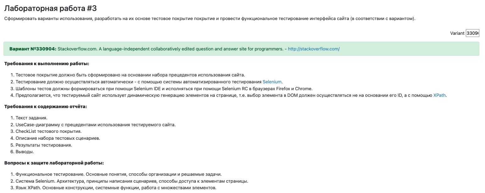

# Лабораторная работа #3
> Рекалов Артём Олегович, P3309, Вариант 330904

Вариант №330904: Stackoverflow.com. A language-independent collaboratively edited question and answer site for programmers. - http://stackoverflow.com/

Сформировать варианты использования, разработать на их основе тестовое покрытие покрытие и провести функциональное тестирование интерфейса сайта (в соответствии с вариантом).

**Требования к выполнению работы:**
- Тестовое покрытие должно быть сформировано на основании набора прецедентов использования сайта.
- Тестирование должно осуществляться автоматически - с помощью системы автоматизированного тестирования Selenium.
- Шаблоны тестов должны формироваться при помощи Selenium IDE и исполняться при помощи Selenium RC в браузерах Firefox и Chrome.
- Предполагается, что тестируемый сайт использует динамическую генерацию элементов на странице, т.е. выбор элемента в - DOM должен осуществляться не на основании его ID, а с помощью XPath.

**Требования к содержанию отчёта:**
- Текст задания.
- UseCase-диаграмму с прецедентами использования тестируемого сайта.
- CheckList тестового покрытия.
- Описание набора тестовых сценариев.
- Результаты тестирования.
- Выводы.

**Вопросы к защите лабораторной работы:**
- Функциональное тестирование. Основные понятия, способы организации и решаемые задачи.
- Система Selenium. Архитектура, принципы написания сценариев, способы доступа к элементам страницы.
- Язык XPath. Основные конструкции, системные функции, работа с множествами элементов.

**Дополнительные требования @nnaumova**:
- Тестовые сценарии необходимо уметь запускать в двух браузерах — chrome и firefox, причем как в обоих сразу параллельно, так и в каком-то одном. В качестве примера можно посмотреть сюда
- Тестовые сценарии мы пишем сами с помощью Selenium WebDriver, а не с помощью Selenium IDE
- Для поиска элементов на странице необходимо использовать XPath, а не идентификаторы
- Никаких Thread.sleep() для ожидания появления элемента на странице — Selenium предлагает свои специализированные средства для этого
- Для удобной организации кода воспользуйтесь паттерном PageObject
- иНе забудьте добавить use-case диаграмму, чек-лист и описание тестовых сценариев (прецедентов использования) в отчет

