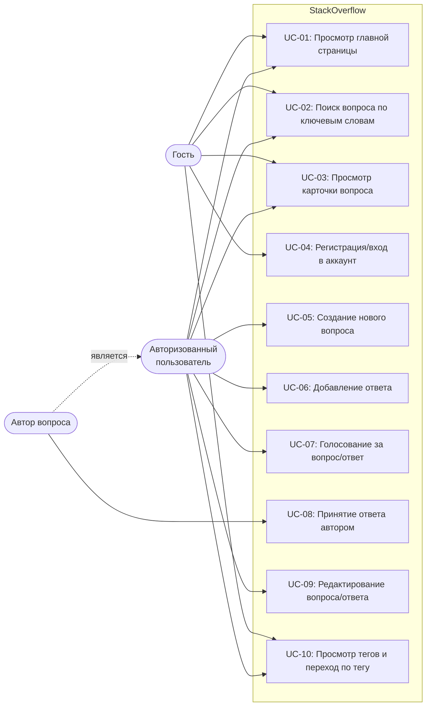

# Use Case Диаграмма — StackOverflow

# Чеклист покрытия

## UC-01 — Просмотр главной страницы (`MainPageTest`)

- [x] Главная страница открывается на домене stackoverflow.com и отображает основные компоненты
- [x] Заголовок первого вопроса не пустой
- [x] Нажатие Log in переходит на страницу логина
- [x] Поиск с главной страницы переходит на страницу результатов
- [x] Поисковый запрос отражается в URL
- [x] Нажатие Ask Question переходит на страницу логина (для гостя)

---

## UC-02 — Поиск вопросов (`SearchPageTest`)

- [x] Поиск переходит на страницу результатов
- [x] Поисковый запрос присутствует в URL
- [x] Поиск по известному запросу возвращает результаты
- [x] Заголовок первого результата не пустой
- [x] Нажатие на первый результат открывает страницу вопроса
- [x] Поиск без совпадений показывает сообщение об отсутствии результатов

---

## UC-03 — Просмотр вопроса (`QuestionPageTest`)

- [x] URL страницы вопроса содержит `/questions/`
- [x] Заголовок вопроса отображается и не пустой, тело вопроса видимо
- [x] Вопрос имеет хотя бы один тег
- [x] Присутствует секция ответов

---

## UC-04 — Авторизация (`LoginPageTest`)

- [x] Страница логина содержит поля email и password
- [x] Валидные данные авторизуют пользователя и перенаправляют на главную
- [x] Невалидные данные показывают сообщение об ошибке

---

## UC-05 — Задать вопрос (`AskQuestionPageTest`)

- [x] Форма Ask Question содержит поля заголовка, тела и тегов
- [x] Отправка без заголовка показывает ошибку валидации
- [x] Заполнение заголовка снимает ошибку валидации
- [x] Создание вопроса с заполненными полями

---

## UC-06 — Написать ответ (`AnswerTest`)

- [x] Редактор ответа видим на странице вопроса для гостя
- [x] Нажатие Post Answer для гостя перенаправляет на логин
- [x] Залогиненный пользователь видит редактор ответа

---

## UC-07 — Голосование (`VoteTest`)

- [x] Кнопки голосования видимы на странице вопроса
- [x] Счётчик голосов отображается
- [x] Гость при нажатии upvote видит тултип о недостаточной репутации
- [x] Гость при нажатии downvote видит тултип о недостаточной репутации
- [x] Залогиненный пользователь при нажатии upvote видит тултип о репутации или голос засчитывается
- [x] Залогиненный пользователь при нажатии downvote видит тултип о репутации или голос засчитывается

---

## UC-08 — Просмотр вопросов по тегу (`TagTest`)

- [x] Нажатие на тег переходит на страницу вопросов по тегу
- [x] Страница тега показывает список вопросов
- [x] Заголовок тега виден
- [x] Заголовок первого вопроса на странице тега не пустой
- [x] Нажатие на вопрос на странице тега открывает страницу вопроса

---

## UC-09 — Закладки / Bookmark (`BookmarkTest`)

- [x] Кнопка Save видима на странице вопроса
- [x] Гость при нажатии Save видит тултип логина
- [x] Залогиненный пользователь может нажать кнопку Save
- [x] Залогиненный пользователь может нажать кнопку Unsave

---

## UC-10 — Сохранённые вопросы (`SavesTest`)

- [x] Профиль пользователя открывается
- [x] Вкладка Saves доступна и показывает сохранённые элементы
- [x] Сохранение вопроса добавляет его в вкладку Saves профиля
- [x] Удаление сохранённого вопроса через меню ⋮ в профиле

# Описание прецедентов использования — StackOverflow

## UC-01: Просмотр главной страницы с вопросами

| Поле                       | Значение                                              |
|----------------------------|-------------------------------------------------------|
| Система                    | Главная страница StackOverflow                        |
| Основное действующее лицо  | Гость / Авторизованный пользователь                   |
| Цель                       | Ознакомиться со списком актуальных вопросов           |
| Триггер                    | Переход на stackoverflow.com                          |
| Результат                  | Видит список актуальных вопросов и навигацию по сайту |

**Основной поток событий:**

| №  | Действующее лицо | Шаг                                                          |
|----|-----------------|--------------------------------------------------------------|
| 1  | Пользователь    | Переходит на stackoverflow.com                               |
| 2  | Система         | Отображает список актуальных вопросов с заголовками          |
| 3  | Система         | Отображает навигационную панель (поиск, теги, меню)          |
| 4  | Пользователь    | Прокручивает список и выбирает интересующий вопрос           |

---

## UC-02: Поиск вопроса по ключевым словам

| Поле                       | Значение                                        |
|----------------------------|-------------------------------------------------|
| Система                    | Строка поиска StackOverflow                     |
| Основное действующее лицо  | Гость / Авторизованный пользователь             |
| Цель                       | Найти релевантные вопросы и ответы              |
| Триггер                    | Ввод запроса в строку поиска и отправка формы   |
| Результат                  | Находит релевантные вопросы и ответы            |

**Основной поток событий:**

| №  | Действующее лицо | Шаг                                                          |
|----|-----------------|--------------------------------------------------------------|
| 1  | Пользователь    | Вводит ключевые слова в строку поиска                        |
| 2  | Пользователь    | Нажимает Enter или кнопку поиска                             |
| 3  | Система         | Формирует запрос к поисковому индексу                        |
| 4  | Система         | Отображает список найденных вопросов с заголовками           |
| 5  | Пользователь    | Просматривает результаты и выбирает интересующий вопрос      |
| 6  | Система         | Открывает страницу выбранного вопроса                        |

**Альтернативный поток (ничего не найдено):**

| №  | Действующее лицо | Шаг                                                          |
|----|-----------------|--------------------------------------------------------------|
| 4а | Система         | Не находит совпадений                                        |
| 4б | Система         | Отображает сообщение «No results found»                      |

---

## UC-03: Просмотр карточки вопроса

| Поле                       | Значение                                                          |
|----------------------------|-------------------------------------------------------------------|
| Система                    | Страница вопроса                                                  |
| Основное действующее лицо  | Гость / Авторизованный пользователь                               |
| Цель                       | Прочитать полный текст вопроса, ответы, теги и статус решения     |
| Триггер                    | Переход по ссылке на вопрос                                       |
| Результат                  | Открывает полный текст вопроса, ответы, теги и статус решения     |

**Основной поток событий:**

| №  | Действующее лицо | Шаг                                                          |
|----|-----------------|--------------------------------------------------------------|
| 1  | Пользователь    | Нажимает на заголовок вопроса в списке                       |
| 2  | Система         | Открывает страницу вопроса `/questions/{id}`                 |
| 3  | Система         | Отображает заголовок, тело вопроса, теги                     |
| 4  | Система         | Отображает список ответов и статус принятого ответа          |
| 5  | Пользователь    | Читает вопрос и ответы                                       |

---

## UC-04: Регистрация/вход в аккаунт

| Поле                       | Значение                                                    |
|----------------------------|-------------------------------------------------------------|
| Система                    | Страница входа/регистрации StackOverflow                    |
| Основное действующее лицо  | Гость                                                       |
| Цель                       | Получить доступ к функциям участия в сообществе             |
| Триггер                    | Нажатие кнопки «Log in» или «Sign up» на главной странице   |
| Результат                  | Получает доступ к функциям участия в сообществе             |

**Основной поток событий (вход):**

| №  | Действующее лицо | Шаг                                                          |
|----|-----------------|--------------------------------------------------------------|
| 1  | Пользователь    | Переходит на главную страницу stackoverflow.com              |
| 2  | Пользователь    | Нажимает ссылку «Log in» в шапке сайта                      |
| 3  | Система         | Отображает форму входа с полями email и password             |
| 4  | Пользователь    | Вводит корректный email в поле «Email»                       |
| 5  | Пользователь    | Вводит корректный пароль в поле «Password»                   |
| 6  | Пользователь    | Нажимает кнопку «Log in»                                     |
| 7  | Система         | Проверяет учётные данные и создаёт сессию                    |
| 8  | Система         | Перенаправляет на главную страницу с именем пользователя     |

**Альтернативный поток (неверные учётные данные):**

| №  | Действующее лицо | Шаг                                                          |
|----|-----------------|--------------------------------------------------------------|
| 6а | Система         | Обнаруживает несоответствие email/пароля                     |
| 6б | Система         | Отображает сообщение об ошибке под формой                    |
| 6в | Пользователь    | Исправляет данные и повторяет попытку                        |

---

## UC-05: Создание нового вопроса

| Поле                       | Значение                                                        |
|----------------------------|-----------------------------------------------------------------|
| Система                    | Раздел «Ask a Question»                                         |
| Основное действующее лицо  | Авторизованный пользователь                                     |
| Цель                       | Опубликовать новый вопрос                                       |
| Триггер                    | Нажатие кнопки «Ask Question» на сайте                         |
| Результат                  | Публикует вопрос с заголовком, текстом и тегами                 |

**Основной поток событий:**

| №  | Действующее лицо | Шаг                                                          |
|----|-----------------|--------------------------------------------------------------|
| 1  | Пользователь    | Нажимает кнопку «Ask Question»                               |
| 2  | Система         | Открывает форму создания вопроса                             |
| 3  | Пользователь    | Вводит заголовок вопроса в поле «Title»                      |
| 4  | Пользователь    | Вводит тело вопроса в редактор                               |
| 5  | Пользователь    | Добавляет один или несколько тегов                           |
| 6  | Пользователь    | Нажимает «Review your question»                              |
| 7  | Система         | Выполняет предварительную проверку полей                     |
| 8  | Пользователь    | Нажимает «Post your question»                                |
| 9  | Система         | Сохраняет вопрос и перенаправляет на его страницу            |

**Альтернативный поток (незаполненный заголовок):**

| №  | Действующее лицо | Шаг                                                          |
|----|-----------------|--------------------------------------------------------------|
| 7а | Система         | Обнаруживает пустое поле «Title»                             |
| 7б | Система         | Отображает ошибку валидации рядом с полем                    |
| 7в | Пользователь    | Заполняет поле и повторяет попытку                           |

---

## UC-06: Добавление ответа

| Поле                       | Значение                                        |
|----------------------------|-------------------------------------------------|
| Система                    | Страница вопроса                                |
| Основное действующее лицо  | Авторизованный пользователь                     |
| Цель                       | Дать ответ на опубликованный вопрос             |
| Триггер                    | Переход на страницу вопроса                     |
| Результат                  | Публикует ответ на вопрос                       |

**Основной поток событий:**

| №  | Действующее лицо | Шаг                                                          |
|----|-----------------|--------------------------------------------------------------|
| 1  | Пользователь    | Открывает страницу вопроса                                   |
| 2  | Пользователь    | Прокручивает страницу до редактора ответа                    |
| 3  | Пользователь    | Вводит текст ответа в редактор                               |
| 4  | Пользователь    | Нажимает кнопку «Post Your Answer»                           |
| 5  | Система         | Сохраняет ответ и отображает его на странице вопроса         |

**Альтернативный поток (пользователь не авторизован):**

| №  | Действующее лицо | Шаг                                                          |
|----|-----------------|--------------------------------------------------------------|
| 4а | Система         | Перенаправляет на страницу входа                             |
| 4б | Пользователь    | Выполняет авторизацию (UC-04)                                |

---

## UC-07: Голосование за вопрос/ответ

| Поле                       | Значение                                                    |
|----------------------------|-------------------------------------------------------------|
| Система                    | Страница вопроса или ответа                                 |
| Основное действующее лицо  | Авторизованный пользователь                                 |
| Цель                       | Повысить или понизить рейтинг контента                      |
| Триггер                    | Нажатие кнопки голосования на странице вопроса              |
| Результат                  | Повышает или понижает рейтинг контента                      |

**Основной поток событий:**

| №  | Действующее лицо | Шаг                                                          |
|----|-----------------|--------------------------------------------------------------|
| 1  | Пользователь    | Открывает страницу вопроса                                   |
| 2  | Пользователь    | Нажимает кнопку ▲ (upvote) или ▼ (downvote) рядом с постом  |
| 3  | Система         | Проверяет право на голосование (репутация ≥ 15 для upvote)  |
| 4  | Система         | Записывает голос и обновляет счётчик                         |
| 5  | Система         | Визуально выделяет нажатую кнопку                            |

**Альтернативный поток (недостаточно репутации):**

| №  | Действующее лицо | Шаг                                                          |
|----|-----------------|--------------------------------------------------------------|
| 3а | Система         | Отображает всплывающее сообщение о недостаточной репутации   |

---

## UC-08: Просмотр тегов и переход по тегу

| Поле                       | Значение                                           |
|----------------------------|----------------------------------------------------|
| Система                    | Страница тега                                      |
| Основное действующее лицо  | Гость / Авторизованный пользователь                |
| Цель                       | Найти вопросы по тематике                          |
| Триггер                    | Нажатие на тег под вопросом или переход на /tags   |
| Результат                  | Находит вопросы по тематике                        |

**Основной поток событий:**

| №  | Действующее лицо | Шаг                                                          |
|----|-----------------|--------------------------------------------------------------|
| 1  | Пользователь    | Нажимает на тег (например, `kotlin`) под вопросом            |
| 2  | Система         | Перенаправляет на `/questions/tagged/kotlin`                 |
| 3  | Система         | Отображает список вопросов с данным тегом                    |
| 4  | Пользователь    | Просматривает список и выбирает интересующий вопрос          |
| 5  | Пользователь    | При необходимости переходит на следующую страницу            |

---

## UC-09: Добавление вопроса в избранное

| Поле                       | Значение                                                    |
|----------------------------|-------------------------------------------------------------|
| Система                    | Страница вопроса                                            |
| Основное действующее лицо  | Авторизованный пользователь                                 |
| Цель                       | Сохранить вопрос для быстрого доступа                       |
| Триггер                    | Нажатие кнопки «Save» на странице вопроса                   |
| Результат                  | Вопрос добавлен в список сохранённых                        |

**Основной поток событий:**

| №  | Действующее лицо | Шаг                                                          |
|----|-----------------|--------------------------------------------------------------|
| 1  | Пользователь    | Открывает страницу вопроса                                   |
| 2  | Пользователь    | Нажимает кнопку «Save» рядом с вопросом                     |
| 3  | Система         | Добавляет вопрос в список сохранённых пользователя           |
| 4  | Система         | Визуально выделяет кнопку «Save» как активную                |

**Альтернативный поток (пользователь не авторизован):**

| №  | Действующее лицо | Шаг                                                          |
|----|-----------------|--------------------------------------------------------------|
| 2а | Система         | Отображает предложение войти в аккаунт                       |

---

## UC-10: Просмотр сохранённых вопросов

| Поле                       | Значение                                                    |
|----------------------------|-------------------------------------------------------------|
| Система                    | Профиль пользователя, вкладка «Saves»                       |
| Основное действующее лицо  | Авторизованный пользователь                                 |
| Цель                       | Найти ранее сохранённые вопросы                             |
| Триггер                    | Переход в профиль → вкладка «Saves»                         |
| Результат                  | Видит список сохранённых вопросов                           |

**Основной поток событий:**

| №  | Действующее лицо | Шаг                                                          |
|----|-----------------|--------------------------------------------------------------|
| 1  | Пользователь    | Переходит на страницу своего профиля                         |
| 2  | Пользователь    | Нажимает вкладку «Saves»                                     |
| 3  | Система         | Отображает список сохранённых вопросов                       |
| 4  | Пользователь    | Выбирает вопрос из списка                                    |

