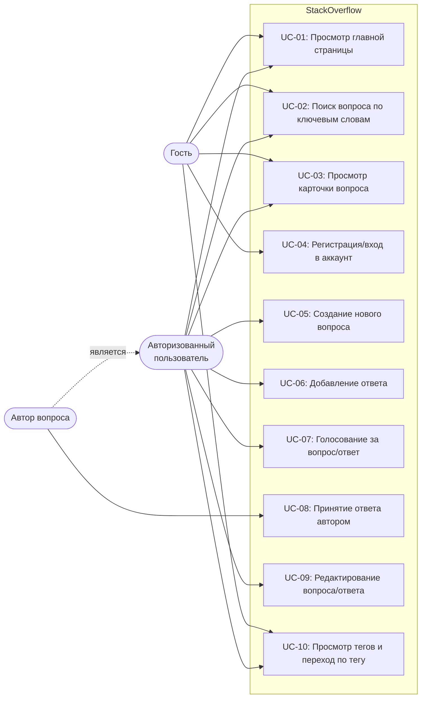

# Use Case Диаграмма — StackOverflow

## Акторы

| Актор                        | Описание                                                         |
|------------------------------|------------------------------------------------------------------|
| Гость                        | Незарегистрированный или не вошедший в аккаунт посетитель сайта  |
| Авторизованный пользователь  | Пользователь, выполнивший вход в свой аккаунт                   |
| Автор вопроса                | Авторизованный пользователь, являющийся владельцем вопроса       |

## Прецеденты

| ID     | Название                           | Доступен гостю | Требует авторизации | Требует авторства |
|--------|------------------------------------|:--------------:|:-------------------:|:-----------------:|
| UC-01  | Просмотр главной страницы          | ✓              | ✓                   |                   |
| UC-02  | Поиск вопроса по ключевым словам   | ✓              | ✓                   |                   |
| UC-03  | Просмотр карточки вопроса          | ✓              | ✓                   |                   |
| UC-04  | Регистрация/вход в аккаунт         | ✓              |                     |                   |
| UC-05  | Создание нового вопроса            |                | ✓                   |                   |
| UC-06  | Добавление ответа                  |                | ✓                   |                   |
| UC-07  | Голосование за вопрос/ответ        |                | ✓                   |                   |
| UC-08  | Принятие ответа автором            |                | ✓                   | ✓                 |
| UC-09  | Редактирование вопроса/ответа      |                | ✓                   |                   |
| UC-10  | Просмотр тегов и переход по тегу   | ✓              | ✓                   |                   |
