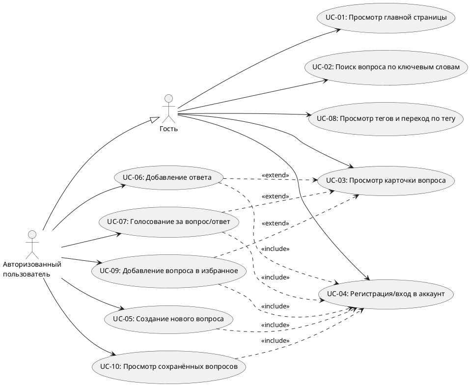

# Use Case Диаграмма — StackOverflow

## Акторы

| Актор                        | Описание                                                        |
|------------------------------|-----------------------------------------------------------------|
| Гость                        | Незарегистрированный или не вошедший в аккаунт посетитель сайта |
| Авторизованный пользователь  | Пользователь, выполнивший вход в свой аккаунт                  |

## Прецеденты

| ID     | Название                           | Доступен гостю | Требует авторизации |
|--------|------------------------------------|:--------------:|:-------------------:|
| UC-01  | Просмотр главной страницы          | ✓              |                     |
| UC-02  | Поиск вопроса по ключевым словам   | ✓              |                     |
| UC-03  | Просмотр карточки вопроса          | ✓              |                     |
| UC-04  | Регистрация/вход в аккаунт         | ✓              |                     |
| UC-05  | Создание нового вопроса            |                | ✓ `<<include>>` UC-04 |
| UC-06  | Добавление ответа                  |                | ✓ `<<include>>` UC-04, `<<extend>>` UC-03 |
| UC-07  | Голосование за вопрос/ответ        |                | ✓ `<<include>>` UC-04, `<<extend>>` UC-03 |
| UC-08  | Просмотр тегов и переход по тегу   | ✓              |                     |
| UC-09  | Добавление вопроса в избранное     |                | ✓ `<<include>>` UC-04, `<<extend>>` UC-03 |
| UC-10  | Просмотр сохранённых вопросов      |                | ✓ `<<include>>` UC-04 |
