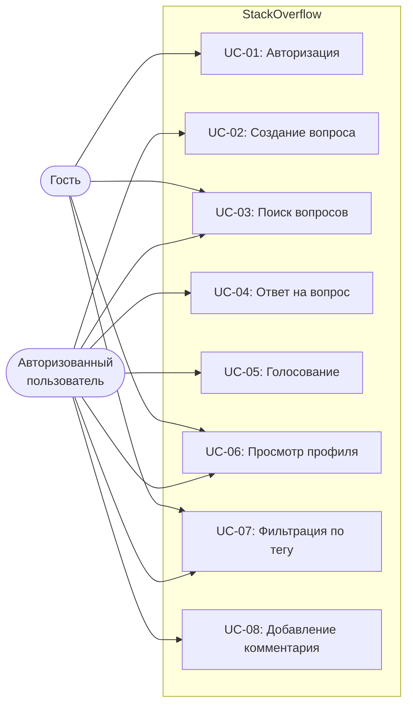

# Use Case Диаграмма — StackOverflow

## Акторы

| Актор                        | Описание                                                         |
|------------------------------|------------------------------------------------------------------|
| Гость                        | Незарегистрированный или не вошедший в аккаунт посетитель сайта  |
| Авторизованный пользователь  | Пользователь, выполнивший вход в свой аккаунт                   |

## Прецеденты

| ID     | Название                  | Доступен гостю | Требует авторизации |
|--------|---------------------------|:--------------:|:-------------------:|
| UC-01  | Авторизация               | ✓              |                     |
| UC-02  | Создание вопроса          |                | ✓                   |
| UC-03  | Поиск вопросов            | ✓              | ✓                   |
| UC-04  | Ответ на вопрос           |                | ✓                   |
| UC-05  | Голосование               |                | ✓                   |
| UC-06  | Просмотр профиля          | ✓              | ✓                   |
| UC-07  | Фильтрация по тегу        | ✓              | ✓                   |
| UC-08  | Добавление комментария    |                | ✓                   |
